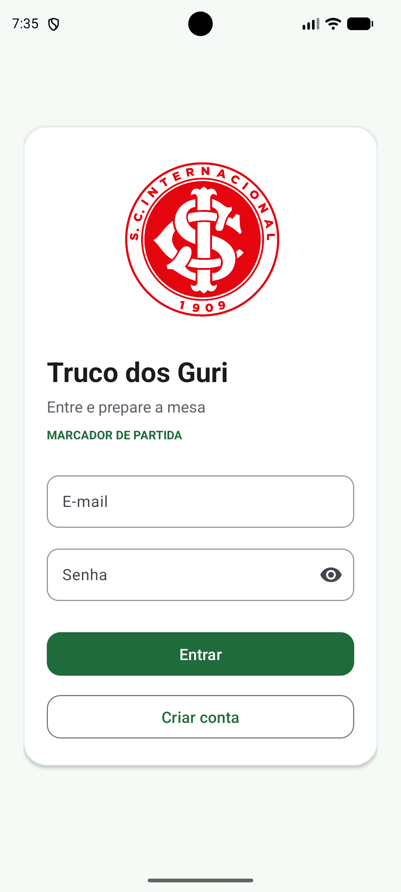
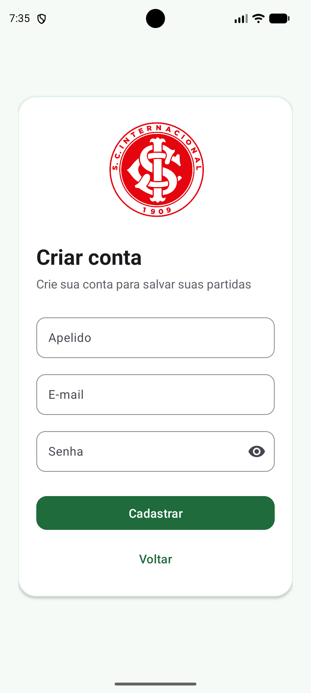
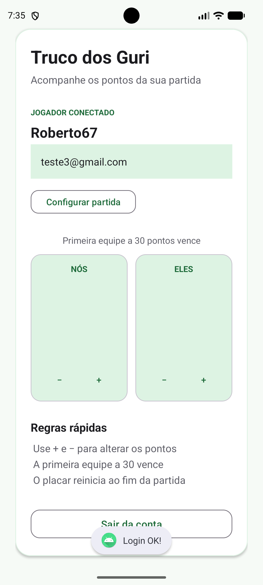

# Truco dos Guri

Um contador de pontos de truco para Android, com login por e-mail e senha usando Firebase Authentication.

> A ideia inicial era somente praticar um fluxo simples de cadastro e login. Depois que a autenticação ficou pronta, o projeto ganhou uma mesa de truco para dar uma brincada e contar os pontos da partida.

## Telas

| Login | Cadastro | Placar |
| :---: | :---: | :---: |
|  |  |  |

## Funcionalidades

- Cadastro e login com e-mail e senha.
- Sessão persistente: ao abrir o app com um usuário autenticado, a mesa é exibida diretamente.
- Logout seguro, retornando para a tela de acesso.
- Placar para as equipes **Nós** e **Eles**.
- Pontos representados por palitos de fósforo em grupos de cinco: quatro lados formam um quadrado e o quinto palito cruza a marcação.
- Configuração de partida até **24** ou **30** pontos.
- Aviso de vencedor e reinício automático do placar ao confirmar.

## Fluxo do app

```text
Login / Cadastro → Mesa de truco → Configurar meta → Contar pontos → Resultado
```

## Tecnologias

- [Kotlin](https://kotlinlang.org/)
- Android Views com XML
- Material 3
- Firebase Authentication
- Gradle Kotlin DSL

## Estrutura principal

```text
app/src/main/
├── java/br/com/uri/meuprojeto/
│   ├── MainActivity.kt           # Login
│   ├── SignupActivity.kt         # Cadastro
│   ├── WelcomeActivity.kt        # Mesa e regras da partida
│   └── MatchstickScoreView.kt    # Desenho do placar de fósforos
└── res/layout/
    ├── activity_main.xml
    ├── activity_signup.xml
    └── activity_welcome.xml
```

## Como executar

### Pré-requisitos

- Android Studio atualizado
- Android SDK 37.1
- Um projeto no Firebase

### Configuração

1. Clone este repositório e abra-o no Android Studio.
2. No [Firebase Console](https://console.firebase.google.com/), crie ou selecione um projeto.
3. Adicione um app Android com o pacote `br.com.uri.meuprojeto`.
4. Em **Authentication → Sign-in method**, ative o provedor **E-mail/senha**.
5. Baixe o `google-services.json` e coloque-o em `app/google-services.json`.
6. Sincronize o Gradle e execute em um emulador ou dispositivo Android.

> O `google-services.json` não é versionado. Cada pessoa deve usar a configuração do próprio projeto Firebase.

## Regras do placar

- Use `+` e `−` para alterar um ponto por vez.
- A meta pode ser configurada para 24 ou 30 pontos.
- Ao alcançar a meta, o app informa a equipe vencedora.
- Após tocar em **OK**, uma nova partida começa em `0 x 0`.

## Próximas ideias

- Salvar histórico de partidas no Firebase.
- Permitir alterar o nome das equipes.
- Adicionar modo escuro e estatísticas de vitórias.
